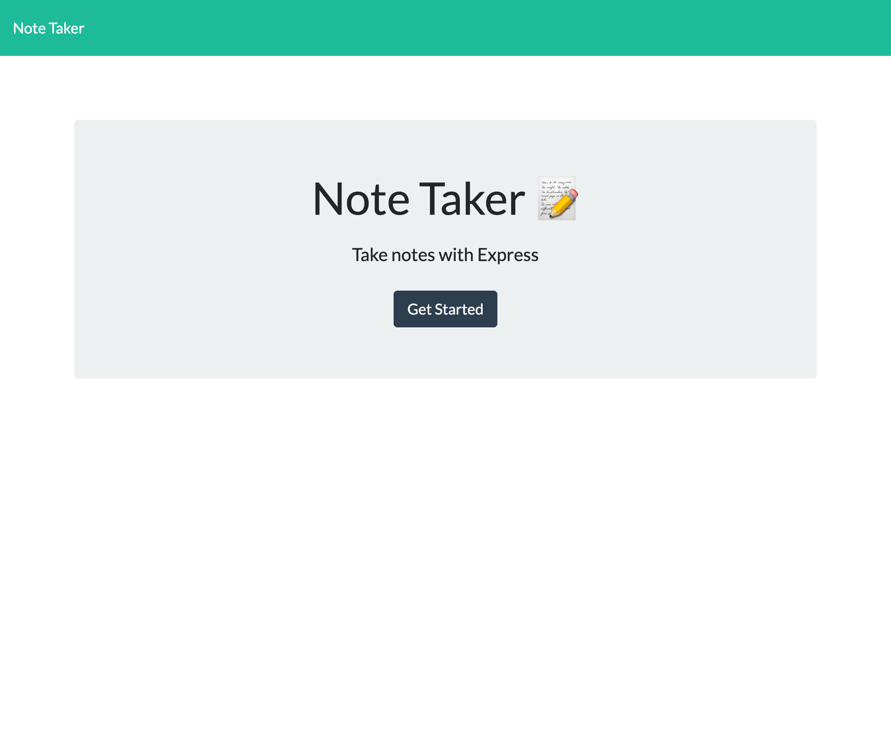
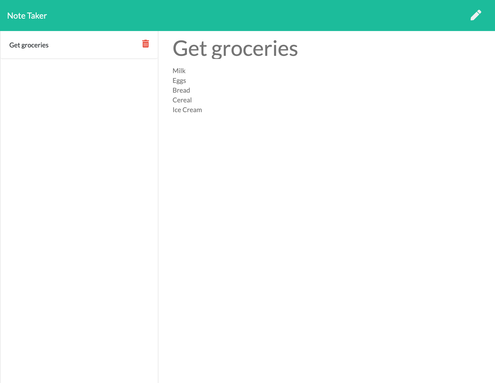
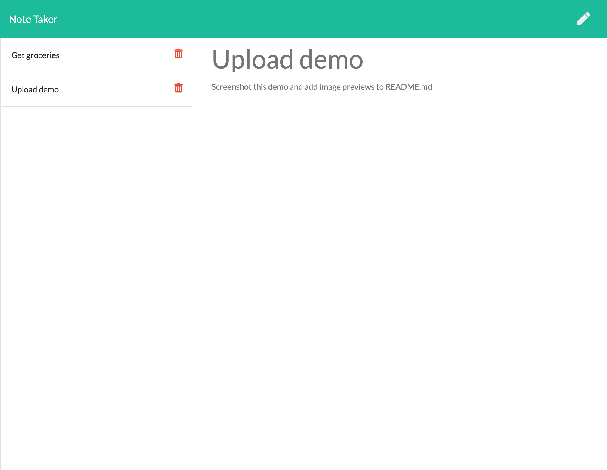

# gt-hw-note-taker


## Description

An application that can be used to write, save, and delete notes. This application uses an express backend and saves/retrieves note data to/from a JSON file.

## Table of Contents

* [Installation](#installation)

* [Usage](#usage)

* [Preview](#preview)

* [License](#license)

* [Contributing](#contributing)

* [Tests](#tests)

* [Questions](#questions)

## Installation

1. Clone the repo.
2. Navigate to project folder in the command line.
3. To install necessary dependencies, run the following command: `npm install`

## Usage

* Run on localhost or visit deployable site on [heroku](https://gt-hw-note-taker-jrp.herokuapp.com/).
* Start creating and managing your notes!

## Preview





## License

This project is licensed under the MIT license.

## Contributing

I am the sole contributor.

## Testing

```
npm run watch
```

## Questions

If you have any questions about the repo, open an issue or contact me directly at jaredp17@me.com. You can find more of my work at [jaredp17](https://github.com/jaredp17/).